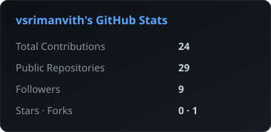
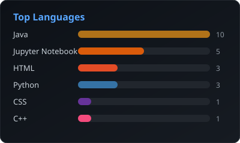
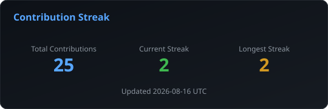
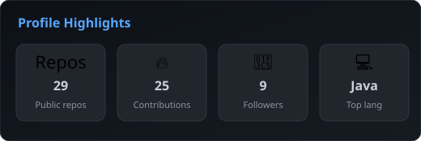

<!-- Profile README for https://github.com/vsrimanvith -->

  <h1>Sri Manvith Vaddeboyina</h1>

  

  

    Backend · full-stack · NLP · systems that hold up in the real world
  

  

    
    &nbsp;
    
    &nbsp;
    
    &nbsp;
    
    &nbsp;
    
  

---

## About

Software engineer who likes building systems that stay quiet in production — clear APIs, careful edges, and interfaces people can actually use.

**Right now** I’m an SDE at **Amazon** on **Physical Security · Optics Video**, working on tools around CCTV video workflows with a **Java** backend and **React** frontend.

- Building internal tools for Physical Security video workflows
- Sweating the details: APIs, reliability, and product UX that doesn’t get in the way
- Always up for a chat about backend, full-stack, NLP, or research software

 

**Before that** I worked across a few different shapes of software:

- **USC ATRI** — Full-stack systems for clinical research
- **TCS** — NLP and search / knowledge-graph products
- **IIT Hyderabad** — Network anomaly detection research

**Education**

- **M.S., Computer Science** — University of Southern California
- **B.Tech, CSE (Gold Medalist)** — JNTU Hyderabad (VNR VJIET)

> *"Everyone should learn how to program because it teaches you how to think."*  
> — Steve Jobs

---

## Languages & Tools

**Languages** — Python · Java · JavaScript · TypeScript · C++ · C · R · SQL · Bash

**Frameworks & Web** — React · Angular · Node.js · Django · Express · Bootstrap

**AI / ML / NLP** — PyTorch · TensorFlow · scikit-learn · Pandas · NumPy · Jupyter

**Cloud · Data · Tools** — AWS · GCP · PostgreSQL · MongoDB · Elasticsearch · Docker · Git · Linux

---

## GitHub Stats

<!-- Hosted locally — third-party stats APIs are often down (503/402). -->

  
  

    

  

    

  

---

  **Thanks for visiting**

    

  

